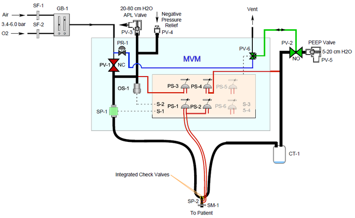

Ventilator
==========

This repository is organized based upon the following multiple parallel (i.e. orphan in Git jargon) branches:
- 🔘 [`master`](../../tree/master) contains the core design.
- 🔘 [`doc`](../../tree/doc) contains documentation.
- 🔘 [`mech`](../../tree/mech) contains mechanical drawings.
- 🔘 [`ele`](../../tree/ele) contains electronics schematics.
- 🔘 [`code`](../../tree/code) contains code.

### Ventilator type - WIP
The Ventilator is inspired by the MVM (Mechanical Ventilator Milano) design from [Galbiati et al. 2020](https://arxiv.org/abs/2003.10405)

<p align="center">
  
</p>

### Project objective - WIP
To build a [Rapidly manufactured ventilator system](https://www.gov.uk/government/publications/coronavirus-covid-19-ventilator-supply-specification/rapidly-manufactured-ventilator-system-specification) to be used only in extreme emergency situation under strict control of a doctor    

### 🔽 How to clone locally specific branches
```sh
$ git clone https://github.com/icub-tech-iit/ventilator.git --branch <branch-name>
```

### ⛑ Maintainers
This repository is maintained by:

| | | |
|:---:|:---|:---|
| [](https://github.com/pattacini) | Ugo Pattacini | [@pattacini](https://github.com/pattacini) |


### 👥 Contributors

| | | | | | |
|:---:|:---|:---|:---:|:---|:---|
| [](https://github.com/maggia80) | Marco Maggiali | [@maggia80](https://github.com/maggia80) | [](https://github.com/pattacini) | Ugo Pattacini | [@pattacini](https://github.com/pattacini) |
| [](https://github.com/vtikha) | Vadim Tikhanoff | [@vtikha](https://github.com/vtikha) | [](https://github.com/andreamerello) | Andrea Merello | [@andreamerello](https://github.com/andreamerello) |
| [](https://github.com/MrAndrea) | Andrea Mura | [@MrAndrea](https://github.com/MrAndrea) | [](https://github.com/Fabrizio69) | Fabrizo Larosa | [@Fabrizio69](https://github.com/Fabrizio69) |
| [](https://github.com/claudiolorini) | Claudio Lorini | [@claudiolorini](https://github.com/claudiolorini) | [](https://github.com/marcoaccame) | Marco Accame | [@marcoaccame](https://github.com/marcoaccame) |
| [](https://github.com/apagnin) | Andrea Pagnin | [@apagnin](https://github.com/apagnin) | [](https://github.com/simeonedussoni) | Simeone Dussoni | [@simeonedussoni](https://github.com/simeonedussoni) |
| [](https://github.com/randaz81) | Marco Randazzo | [@randaz81](https://github.com/randaz81) | [](https://github.com/MarcoCrepaldi-iit) | Marco Crepaldi | [@MarcoCrepaldi-iit](https://github.com/MarcoCrepaldi-iit) |
| [](https://github.com/mircodisalvo) | Mirco Di Salvo | [@mircodisalvo](https://github.com/mircodisalvo) | [](https://github.com/Nicogene) | Nicolò Genesio | [@Nicogene](https://github.com/Nicogene) |
| [](https://github.com/mirkoprato) | Mirko Prato | [@mirkoprato](https://github.com/mirkoprato) | [](https://github.com/RossiFederico)  | Federico Rossi | [@RossiFederico](https://github.com/RossiFederico) |
| [](https://github.com/LucaBottazzi) | Luca Bottazzi | [@LucaBottazzi](https://github.com/LucaBottazzi) | [](https://github.com/mcivinelli) | Marco Civinelli | [@mcivinelli](https://github.com/mcivinelli) |
| [](https://github.com/gpghiroldi) | Gian Pietro Ghiroldi | [@gpghiroldi](https://github.com/gpghiroldi) | [](https://github.com/marcoreds81) | Marco Rossi | [@marcoreds81](https://github.com/marcoreds81) |
