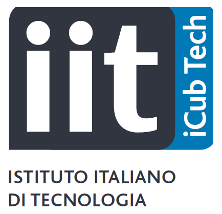
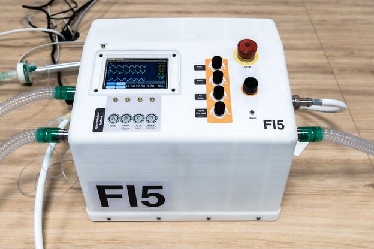
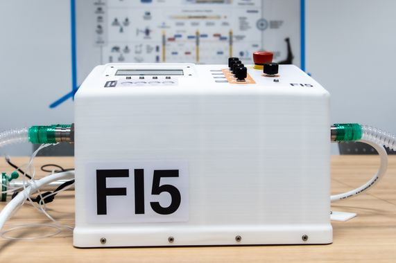
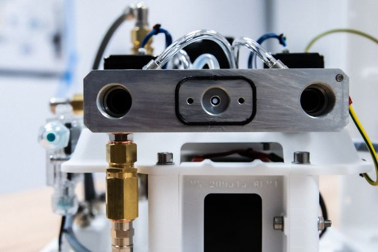
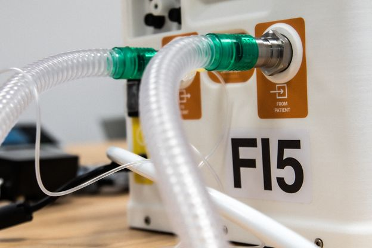
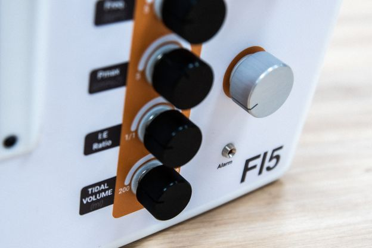
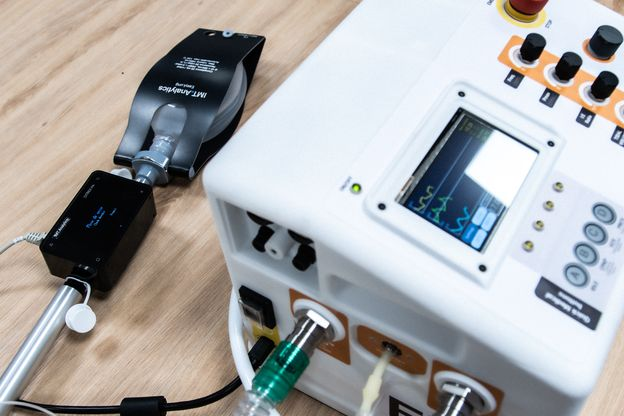

Ventilator FI5
==============

Medical infrastructures are certainly equipped with critical technologies, however, these are not available in huge numbers to handle the excessive volume of patients associated with SARS-CoV-2 pandemic. Ventilators are a type of technology which is currently in very short supply. Today, the health system relies exclusively on specialized, proprietary, mass-manufactured ventilators purchased from a small selection of suppliers. This supply model clearly fails when there is a sudden surge in demand for a relatively low-volume specialty product. To fill this shortage, [**Scuderia Ferrari Mission Winnow**](https://www.missionwinnow.com/en/scuderia-ferrari.html) and [**Istituto Italiano di Tecnologia**](https://iit.it) (IIT) have joined forces to come up with a pulmonary ventilator, named **FI5**, that can be used by hospitals as a vital tool when dealing with emergencies such as the current COVID-19 virus global pandemic.

**FI5** has been designed to meet the typical demands of medium intensive care. It is reliable, versatile, easy to use and assemble, able to optimize oxygen consumption and with the possibility to be produced in large quantities using easily available materials, so as to have a far lower cost than that of the pulmonary ventilators currently on the market. The technical specifications of FI5, drawings, firmware, software and list of components are now available as an open-source project, which means anyone can produce it.

FI5 is the result of an intense and well-coordinated teamwork. Ferrari’s engineers did the CAD design work to define the pneumatic and mechanical parts and dynamic simulation. IIT sourced all materials and designed electronics, firmware and control software, also playing its part in the simulation, development and design of the wiring system thanks to the use of Ferrari’s supply chain. All the work was carried out strictly following the processing logic and complying with the necessary requirements in terms of safety and reliability, so that F15 can be effectively used on the field.

List of **IIT facilities and research lines** that contributed to the FI5 project:

| | |
| :---: | :--- |
| [](https://www.iit.it/web/icub-tech) | [iCub Tech](https://www.iit.it/web/icub-tech) |
| [](https://www.iit.it/web/electronic-design-laboratory) | [Electronic Design Laboratory](https://www.iit.it/web/electronic-design-laboratory) |
| [](https://www.iit.it/web/rehab-technologies-inail-iit-lab) | [Rehab Technologies - INAIL-IIT lab](https://www.iit.it/web/rehab-technologies-inail-iit-lab) |

## DISCLAIMER
Fondazione Istituto Italiano di Tecnologia (“IIT”), having its headquarters in Genova (Italy), via Morego 30, declares that the designs, technical specifications, documents and other materials (“Material”) contained  on this repository are the result of scientific research activities carried out by IIT’s personnel in the context of the project FI5 (“Rapidly manufactured ventilator system”). 

The Material is made available to Users only to facilitate the design of a replicable prototype of a ventilator that is not legally classified as medical device under the laws and regulations of the country where it was developed, nor is CE marked.  Any prototype shall in any case undergo mandatory procedures set forth by the laws and regulations in force in the country of prospective use prior to any use (compassionate use included) and/or commercialization.

By using the Material, you are agreeing to the following disclaimer.

IIT provides the Material “AS IS”, and makes no representations or warranties of any kind whatever concerning the Material, whether express or implied. This includes, without limitation, warranties of merchantability, fitness for a particular purpose, non-infringement, absence of latent or other defects, accuracy, or the presence or absence of errors, the precision or reasonableness of assumptions, studies and conclusions based on scientific facts or data, whether or not known or discoverable.

IIT will not track, and will not be liable for the User’s use of the Material, and is not liable for any violation of law committed or suffered by the User in connection with its use of the Material. In no event will IIT be liable, and hereby explicitly waives all liability, for any direct, special, indirect, incidental, consequential, or other losses, costs, expenses, or damages of any kind arising out of the Material or use of the Material, even if IIT has been advised of the possibility of such losses, costs, expenses, or damages.

## ⚙ Technical specifications
Here's the document containing the [**`FI5 technical specifications`**](./design/FI5-specs.pdf).

| |
| :---: |
|  |
|  |
|  |

## 🌿 Repository structure
This repository is organized based upon the following multiple parallel (i.e. orphan in Git jargon) branches:
- 🔘 [`master`](../../tree/master) contains the core design.
- 🔘 [`doc`](../../tree/doc) contains supporting documents.
- 🔘 [`mech`](../../tree/mech) contains mechanical drawings.
- 🔘 [`ele`](../../tree/ele) contains electronics schematics.
- 🔘 [`code`](../../tree/code) contains code.

### 🔽 How to clone specific branches locally
```sh
$ git clone https://github.com/icub-tech-iit/ventilator-FI5.git --single-branch --branch <branch-name>
```

Be careful that `mech` and `ele` branches are handled via [Git LFS](https://help.github.com/en/articles/installing-git-large-file-storage).

### 📦 Releases
You can conveniently download the whole material by visiting the [Release Page](../../releases).

## 📰 News
- [IIT](https://iit.it/iit-vs-covid-19/fi5-ventilator)
- [Scuderia Ferrari Mission Winnow](https://www.ferrari.com/en-EN/formula1/articles/scuderia-ferrari-and-italian-institute-of-technology-present-fi5)
- [Reuters](https://www.reuters.com/video/watch/ferrari-helps-drive-high-speed-developme-id713018857?chan=2iglyxg3)
- [Askanews](http://www.askanews.it/video/2020/05/13/maggiali-iit-respiratore-fi5-contro-il-virus-ora-open-source-20200513_video_12551772) (Italian)
- [Il Sole 24 Ore](https://stream24.ilsole24ore.com/video/economia/maggiali-iit-respiratore-fi5-contro-virus-ora-open-source/ADf1VOQ) (Italian)
- [Il Sole 24 Ore](https://stream24.ilsole24ore.com/video/italia/ventilatore-polmonare-ferrari-iit-parla-ingegnere-maranello/ADfyJTu) (Italian)
- [MSN](https://www.msn.com/it-it/money/video/f15-un-ventilatore-polmonare-nato-da-sinergia-tra-iit-e-ferrari/vi-BB142gMe) (Italian)
- [Federation Internationale De L'Automobile](https://www.fia.com/news/scuderia-ferrari-mission-winnow-and-italian-institute-technology-present-fi5)
- [Formula1](https://www.formula1.com/en/latest/article.ferrari-unveil-new-ventilator-for-coronavirus-patients-designed-and-built-in.7DrOsmsbQB9piUafeuuXJA.html)
- [Gazzetta MOTORI](https://www.gazzetta.it/Formula-1/13-05-2020/coronavirus-arriva-fi5-ventilatore-creato-ferrari-istituto-italiano-tecnologia-370941034843.shtml) (Italian)
- [GenovaQuotidana](https://genovaquotidiana.com/2020/05/13/nuovo-respiratore-polmonare-firmato-scuderia-ferrari-mission-winnow-e-iit) (Italian)
- [Corriere.it](https://www.corriere.it/sport/formula-1/notizie/coronavirus-f1-all-ospedale-ecco-ventilatore-polmonare-fi5-progettato-sole-cinque-settimane-b1168c74-9510-11ea-b53d-888d5c72a186_preview.shtml) (Italian)
- [La Stampa](https://www.lastampa.it/motori/tecnologia/2020/05/13/news/ferrari-e-istituto-italiano-di-tecnologia-contro-il-coronavirus-nasce-il-ventilatore-polmonare-fi5-1.38839589) (Italian)
- [La Repubblica](https://www.repubblica.it/dossier/cronaca/italia-riparte/2020/05/13/news/ferrari_il_record_piu_bello_solo_5_settimane_per_creare_i_ventilatori_polmonari-256526848) (Italian)
- [ESPN](https://www.espn.in/f1/story/_/id/29169438/ferrari-reveals-details-low-cost-covid-19-ventilator)
- [ESPN](http://ja.espnf1.com/ferrari/motorsport/story/259754.html) (Japanese)
- [GPTODAY.net](https://www.gptoday.net/en/news/f1/255479/ferrari-produces-new-ventilator-for-facilities-dealing-with-covid-19-patients)
- [News1](https://www.news1.news/n1/2020/05/ferrari-and-italian-institute-of-technology-against-coronavirus-the-lung-ventilator-fi5-la-stampa-is-born.html)
- [Le Figaro](https://sport24.lefigaro.fr/scan-sport/actualites/ferrari-devoile-fi5-son-respirateur-artificiel-pour-lutter-contre-le-coronavirus-1001783) (French)
- [Marca](https://www.marca.com/motor/2020/05/13/5ebbe0baca4741bd618b4615.html) (Spanish)
- [Business Insider](https://www.businessinsider.in/sports/news/ferrari-helps-design-new-low-cost-ventilator-in-coronavirus-battleto/articleshow/75724414.cms)
- [Sky Tg24](https://tg24.sky.it/bologna/2020/05/13/ferrari-progetta-ventilatore-polmonare-in-5-settimane) (Italian)
- [Rai News](http://www.rainews.it/dl/rainews/media/Coronavirus-Ferrari-e-Istituto-italiano-di-Tecnologia-insieme-per-un-ventilatore-polmonare-low-cost-d8e9ec2a-051e-458f-933c-15627c3b3f5b.html) (Italian)
- [El Universal](https://www.eluniversal.com.mx/english/scuderia-ferrari-and-italian-institute-technology-donate-fi5-ventilator-mexico)

## 🎥 Media

| 🔘 Click to play (English) | 🔘 Click to play (Italian) |
| :---: | :---: |
| [](https://youtu.be/0cS7hDUI7wY) | [](https://youtu.be/8o9P0SrOOLM) |

---

| 🔘 Click to enlarge | 🔘 Click to enlarge |
| :---: | :---: |
| [](./assets/ODP00242.jpg) | [](./assets/ODP00248.jpg) |
| [](./assets/ODP00252.jpg) | [](./assets/ODP00255.jpg) |
| [](./assets/ODP00256.jpg) | [](./assets/ODP00265.jpg) |


## 👥 Contributors

| | | | | | |
|:---:|:---|:---|:---:|:---|:---|
| [](https://github.com/maggia80) | Marco Maggiali | [@maggia80](https://github.com/maggia80) | [](https://github.com/CorradoOnorato) | Corrado Onorato | [@CorradoOnorato](https://github.com/CorradoOnorato) |
| [](https://github.com/pattacini) | Ugo Pattacini | [@pattacini](https://github.com/pattacini) | [](https://github.com/vtikha) | Vadim Tikhanoff | [@vtikha](https://github.com/vtikha) |
| [](https://github.com/MrAndrea) | Andrea Mura | [@MrAndrea](https://github.com/MrAndrea) | [](https://github.com/Fabrizio69) | Fabrizo Larosa | [@Fabrizio69](https://github.com/Fabrizio69) |
| [](https://github.com/claudiolorini) | Claudio Lorini | [@claudiolorini](https://github.com/claudiolorini) | [](https://github.com/marcoaccame) | Marco Accame | [@marcoaccame](https://github.com/marcoaccame) |
| [](https://github.com/apagnin) | Andrea Pagnin | [@apagnin](https://github.com/apagnin) | [](https://github.com/simeonedussoni) | Simeone Dussoni | [@simeonedussoni](https://github.com/simeonedussoni) |
| [](https://github.com/andreamerello) | Andrea Merello | [@andreamerello](https://github.com/andreamerello) | [](https://github.com/MarcoCrepaldi-iit) | Marco Crepaldi | [@MarcoCrepaldi-iit](https://github.com/MarcoCrepaldi-iit) |
| [](https://github.com/mircodisalvo) | Mirco Di Salvo | [@mircodisalvo](https://github.com/mircodisalvo) | [](https://github.com/Nicogene) | Nicolò Genesio | [@Nicogene](https://github.com/Nicogene) |
| [](https://github.com/mirkoprato) | Mirko Prato | [@mirkoprato](https://github.com/mirkoprato) | [](https://github.com/RossiFederico)  | Federico Rossi | [@RossiFederico](https://github.com/RossiFederico) |
| [](https://github.com/LucaBottazzi) | Luca Bottazzi | [@LucaBottazzi](https://github.com/LucaBottazzi) | [](https://github.com/mcivinelli) | Marco Civinelli | [@mcivinelli](https://github.com/mcivinelli) |
| [](https://github.com/fbiggi) | Filippo Biggi | [@fbiggi](https://github.com/fbiggi) | [](https://github.com/Gandoo) | Davide Gandini | [@Gandoo](https://github.com/Gandoo) |
| [](https://github.com/emilianob80) | Emiliano Barbieri | [@emilianob80](https://github.com/emilianob80) | [](https://github.com/randaz81) | Marco Randazzo | [@randaz81](https://github.com/randaz81) |
| [](https://github.com/gpghiroldi) | Gian Pietro Ghiroldi | [@gpghiroldi](https://github.com/gpghiroldi) | [](https://github.com/marcoreds81) | Marco Rossi | [@marcoreds81](https://github.com/marcoreds81) |
| [](https://github.com/fiorisi) | Luca Fiorio | [@fiorisi](https://github.com/fiorisi) | [](https://github.com/marcellosavoldi) | Marcello Savoldi | [@marcellosavoldi](https://github.com/marcellosavoldi) |
| [](https://github.com/Miche19) | Simone Michelini | [@Miche19](https://github.com/Miche19) | [](https://github.com/traversaro) | Silvio Traversaro | [@traversaro](https://github.com/traversaro) |
| [](https://github.com/Andreamenini68) | Andrea Menini | [@Andreamenini68](https://github.com/Andreamenini68) | [](https://github.com/zapparella) | Salvatore Zapparella | [@zapparella](https://github.com/zapparella) |
| [](https://github.com/silviacriscenzo) | Silvia Criscenzo | [@silviacriscenzo](https://github.com/silviacriscenzo) | [](https://github.com/miggia) | Alberto Parmiggiani | [@miggia](https://github.com/miggia) |
| [](https://github.com/LucaBrunatto) | Luca Brunatto | [@LucaBrunatto](https://github.com/LucaBrunatto) | [](https://github.com/mgentili81) | Marco Gentili | [@mgentili81](https://github.com/mgentili81) |
| [](https://github.com/SilviaScar) | Silvia Scarpetta | [@SilviaScar](https://github.com/SilviaScar) | [](https://github.com/mlaffranchi) | Matteo Laffranchi | [@mlaffranchi](https://github.com/mlaffranchi) |
| [](https://github.com/falberticc) | Francesco Alberti | [@falberticc](https://github.com/falberticc) | [](https://github.com/LDM73) | Lorenzo De Michieli | [@LDM73](https://github.com/LDM73) |
| [](https://github.com/mpinaffo) | Marco Pinaffo | [@mpinaffo](https://github.com/mpinaffo) |
| [](https://github.com/amingotti) | Alberto Mingotti | [@amingotti](https://github.com/amingotti) |
| | Laura Taverna | | | Marco Ghidini | |
| | Simone Codeluppi | | | Roberto Puddu | |
| | Federico Palmieri | | | Bruno Petrini| |
| | Marco Ricci | | | Ferdinando Muto | |
| | Marco Solieri | | | Federico Ghirardi | |
| | Maurizio Busi | | | Luca Rivano | |
| | Carlo Tacchino | | | Marco Freddolini | |

## 🙏 Acknowledgements
We would like to thank the team [**Camozzi**](https://en.automation.camozzi.com/) for their invaluable support that allowed us to correctly model the key elements of the FI5 ventilator.

## 🆓 License
The files contained in this repository are licensed under the [BSD-3-Clause](https://opensource.org/licenses/BSD-3-Clause) license, except the following files: 
* [C++](https://en.wikipedia.org/wiki/C%2B%2B) files generated by [MATLAB](https://www.mathworks.com/products/matlab.html), contained in the [`code`](../../tree/code) git branch, that are licensed under the terms described in [MATLAB's Software License Agreement](https://web.archive.org/web/20200508100444/https://www.mathworks.com/help//pdf_doc/matlab/offering.pdf) Part Two.
* [Embedded Wizard](https://www.embedded-wizard.de/) files provided by [TARA Systems GmbH](https://www.tara-systems.de/), that are licensed under the terms described in [Embedded Wizard End User License Agreement](../../tree/code/tests/boards/stm32f7disco/ew/PlatformPackage/License.txt).
* [CMSIS](https://www.arm.com/why-arm/technologies/cmsis) [files](../../tree/code/generated/Drivers/CMSIS) provided by [arm](https://www.arm.com/), that are licensed under the terms of the [Apache License, Version 2.0](www.apache.org/licenses/LICENSE-2.0).

## ✉ Contacts
If you need further information on the FI5 project, don't hesitate to send an email to <**ventilator-FI5 _at_ iit.it**>.
