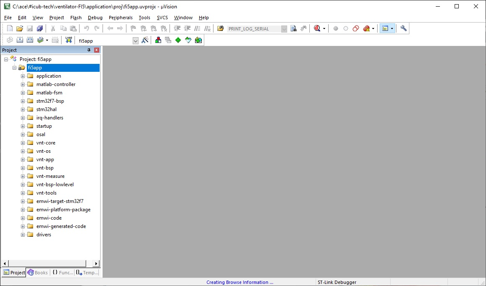
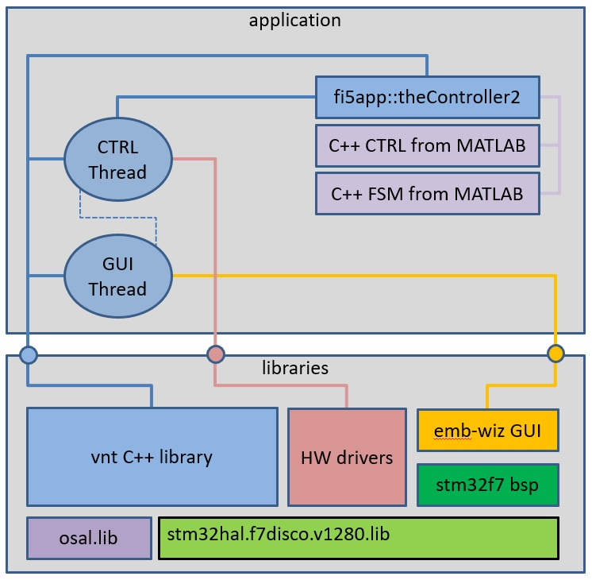
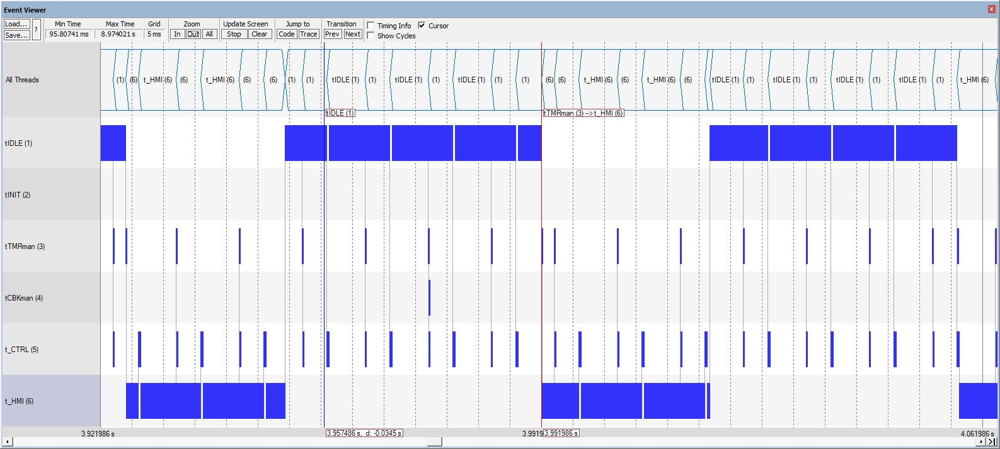
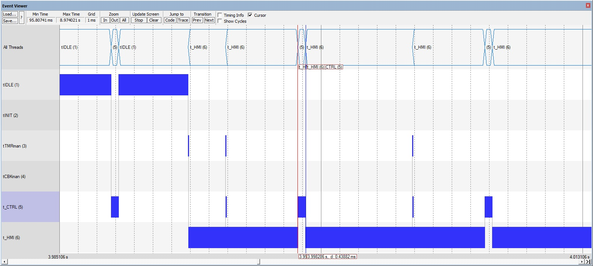

Ventilator FI5: code
==========


This repository contains the code which runs on the microcontroller inside the control board of the ventilator FI5, or CTR1 system, as described in section 3.3.1 of the [**`FI5 technical specifications`**](https://github.com/icub-tech-iit/ventilator-FI5/blob/master/design/FI5-specs.pdf), or **FI5-TS**.

In the following is a description of what the code does, how to load its latest binary, how to compile the source code, a basic description of its internals. The documents ends with a description of the folder structure of this `code` branch.


## What the code does


The code which runs on STM32F746 Discovery Board has the following tasks:

- to read the flow meters and pressure sensors of the ventilator,
- to read values from knobs and push buttons used for HMI,
- to execute the ventilator controller described in section 4.5 of the **FI5-TS**,
- to run the FSM with logic of the HMI as described in section 4.6 of the **FI5-TS**,
- to drive the output valves,
- to update the output of the HMI, namely LEDs, buzzer and the content of the LCD display.


## How to load the binary code

The latest binary code is  [`application/bin/fi5app.hex`](https://github.com/icub-tech-iit/ventilator-FI5/blob/code/application/bin/fi5app.hex). It can be loaded in the ventilator following these steps:

- install of a programming software tool such as [STM32CubeProg](https://www.st.com/en/development-tools/stm32cubeprog.html) or similar.

- attach a cable double ended with type USB A male from the PC to the programming USB port on the left of the ventilator

- load the binary file, disconnect the cable and restart the ventilator.


| | |
| :----: | :---: |
|   |      |


## How to compile the code


The entry point of the application code is the project [application/proj/fi5app.uvprojx](https://github.com/icub-tech-iit/ventilator-FI5/blob/code/application/proj/fi5app.uvprojx). It requires a [MKD-ARM](https://www.keil.com/demo/eval/arm.htm) compiler version 5.30 or higher with a suitable license. The application project links some libraries which are to be compiled beforehand. They are the `osal` and the `stm32hal` libraries. It also need to generate some C files for the GUI which runs on the LSD display.

Here are detailed instructions.

- Install and register a a [MKD-ARM](https://www.keil.com/demo/eval/arm.htm) compiler version 5.30 or higher.

- Open the project [libraries/stm32hal/proj/stm32hal.f7.uvprojx](https://github.com/icub-tech-iit/ventilator-FI5/blob/code/libraries/stm32hal/proj/stm32hal.f7.uvprojx) and compile its target to produce the library `libraries/stm32hal/lib/stm32hal.f7disco.v1280.lib`.

- Open the project [libraries/osal/proj/osal-v5.uvprojx](https://github.com/icub-tech-iit/ventilator-FI5/blob/code/libraries/osal/proj/osal-v5.uvprojx) and compile its target to produce the library `libraries/osal/lib/osal.cm4.dbg.lib`.

- Produce the C files required for the GUI following instructions of [VentilatorUI/README.md](https://github.com/icub-tech-iit/ventilator-FI5/blob/code/VentilatorUI/README.md)

- Open the project [application/proj/fi5app.uvprojx](https://github.com/icub-tech-iit/ventilator-FI5/blob/code/application/proj/fi5app.uvprojx) and compile the target `fi5app` to produce the binary into  [`application/bin/fi5app.hex`](https://github.com/icub-tech-iit/ventilator-FI5/blob/code/application/bin/fi5app.hex). 

  


## How the code is structured


The code of the project is structured as in the following diagram.




We have two separate sections of code which are placed in folder of the same name.

- The `application` part, which runs the actual application.  
- The `libraries` part which offers services to the `application`.


### The application

This code contains the `main()` which runs the application. The `main()` starts a fully preemptive RTOS environment offered by the  `vnt::os` service and it starts two user-threads: one high priority real-time control thread called `tCTRL` and other with lower priority called `tHMI `which runs the GUI on the LCD.

```C++

int main(void)
{
    // initialise the os
    vnt::os::init(osconfig);        
    // and start it    
    vnt::os::start();
}

void initSystem(vnt::os::Thread *t, void* initparam)
{
    ...
    // start the tCTRL thread [at exit of tINIT thread]
    fi5app::tCTRL::start();
    
    // start the tHMI thread [at exit of tINIT thread]
    fi5app::tHMI::start();    
    ...       
}
```


#### The control thread

The control thread is executed at a high priority every 10 milliseconds. It does the following.

- It reads HW through the services of the `driver` library. In particular, it reads sensors (flowmeters and and pressure ones), it reads the stimuli from the user buttons and the values of the knobs. 
- It feeds the object `fi5app::theController2` with the above inputs data. In turns, this objects ticks the C++ code generated by MATLAB which:
  - runs the state machine which obtains the status of control mode, of the LEDs, of the buzzer; 
  - runs the controller which computes the actuations for the valves, the output values to be sent to the LCD display.  

- it apply the actuations to the HW through the services of the `driver` library.
- It communicates to the `tHMI` thread the values to be displayed on the LCD.


Here is a code excerpt with the bulk of its execution, which is triggered by the RTOS with emission of an `EVT::tick` every 10 milliseconds.

```c++
void onevent(vnt::os::Thread *t, vnt::os::EventMask eventmask, void *param)
{
    vnt::bsp::watchdog::refresh();  
    
    if(0 == eventmask)
    {   // timeout ...         
        return;
    }

    if(true == vnt::core::binary::mask::check(eventmask, vnt::core::tointegral(EVT::tick)))
    {   // ticked every 10 ms.             
        driverinput.data.read_mask = BOARD_ALL_SENSORS;  
        // starts hw reading. when finished the driver will emit EVT::dataready         
        board_read_sensors_async(&driverinput.data, alertme); 
    }

    if(true == vnt::core::binary::mask::check(eventmask, vnt::core::tointegral(EVT::dataready)))
    {
        static uint32_t _tick = 0;
        fi5app::theController2::getInstance().load(driverinput.data);
        fi5app::theController2::getInstance().tick();
        // we fill driveroutput and sharedHMIdata so that the tHMI can display it. 
        // concurrent access protection is inside
        apply(driveroutput, sharedHMIdata, fi5app::theController2::getInstance().getOut());        
        // we write to drivers        
        board_apply_actuation(&driveroutput.out);    
        // print a log (if enabled)        
        print_log(fi5app::theController2::getInstance().getInp(), 
                  fi5app::theController2::getInstance().getOut(), 
                  fi5app::theController2::getInstance().get_fsmOut(), 
                  fi5app::theController2::getInstance().get_ctrlOut());        
        _tick++;        
    }  
}
```


#### The GUI thread

The control thread is executed at a low priority every 66 milliseconds. It just ticks the GUI library which retrieves the data to display in a shared memory location populated by the threat `tCTRL`. 

Here is a code excerpt with the bulk of its execution, which is triggered by the RTOS with emission of an `EVT::tick` every 66 milliseconds.

```C++
void onevent(vnt::os::Thread *t, vnt::os::EventMask eventmask, void *param)
{
    vnt::bsp::watchdog::refresh();  
    
    if(0 == eventmask)
    {   // timeout ...         
        return;
    }

    if(true == vnt::core::binary::mask::check(eventmask, vnt::core::tointegral(EVT::tick)))
    {
        EwProcess();        
    }   
    
}
```


#### Interaction amongst threads

The RTOS environment implemented with `vnt::os` offers some services such as timer and callback manager, each run by a thread, has an `tIDLE` thread executed when nothing is ready to execute and finally has a `tINIT` thread which starts user-threads such as our `tCTRL` and `tHMI`. In here are pictures of the scheduling activities of the system. We can see the periodicity of the two user-threads and also how `tCTRL` overrides execution over `tHMI` when it needs.

|   |
| ---------------------------- |
|  |

 

### The libraries

This code contains the services required by the application. We have the following modules.

- The HAL offered by STM which is tailored for the used board `f7disco` wrapped into a compiled library named `stm32hal.f7disco.v1280.lib`. 
- The `driver` code which we use to read sensors, push button and knobs and to apply actuations and LEDs. It uses teh services of the `stm32hal.f7disco.v1280.lib`. 
- The BSP offered by STM for this board.
- The GUI library offered by Embedded Wizard. It uses the services of the BSP and of the `stm32hal.f7disco.v1280.lib`.
- The `osal` library which offers the RTOS services with an abstraction layer which makes it easier to adopt a different RTOS, possibly certified for critical applications.
- The `vnt` C++ library of classes which uses the services of the `osal`and of the `stm32hal.f7disco.v1280.lib`. This library is the one used to build the skeleton of the application and to glue into it the C++ code generated by MATLAB.


## Folder organization

This repository is organized as follows:

- Folder `application` will contain the entry point of the embedded application running on the ventilator.
- Folder `assets` contains pictures for this `README.md` file.
- Folder `fsm` contains the MATLAB code for the state machine of the ventilator.
- Folder `libraries` will contain the final version of the libraries which have been tested in folder `tests/boards/stm32f7disco`. The libraries are:
  - `drivers`: contain the embedded C code used for reading sensors and applying actuations.
  - `ew`: contains code from Embedded Wizard which implements the UI on the LCD display of our development board with some changes we did to it so that it could integrate into our applications.  
  - `osal`: it contains the RTOS code which beats inside the ventilator.
  - `stm32-bsp`: contains the board support package offered by STM Microelectronics for our development board which was lightly modified to be used in our demos.
  - `stm32hal`:  contains the hardware abstraction layer from ST Microelectronics customized for our development board and compiled into a static library.
  - `vnt`: contains a C++ library which wraps HW, OS and offers an easier framework for application development. 

- Folder `log` contains the log files produced by running `demo014` on the ventilator. 

- Folder `tests` contains the continuous and incremental tests done on the development board which was eventually used for the ventilator. In this folder there are draft versions of the libraries for RTOS, HAL, graphics, C++ utilities, and also a dedicated folder with a project for each test. The project under folder `demo013` is the one used for the public presentation of the ventilator FI5 on 13 may 2020. We have produced also a `demo014` with some small optimizations and code refactoring.

- Folder `VentilatorUI` contains the project of the user interface shown on the display of the ventilator.

  


