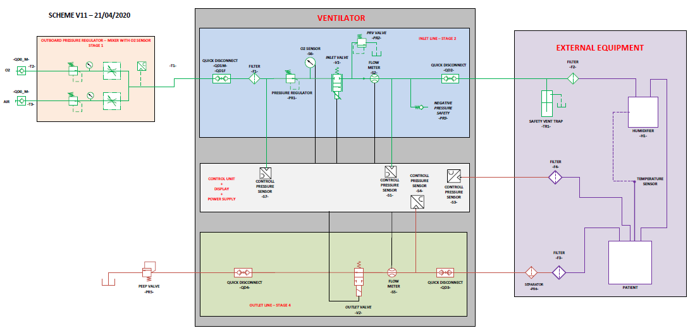

Ventilator FI5
==============

## DISCLAIMER

Fondazione Istituto Italiano di Tecnologia (“IIT”), having its headquarters in Genova (Italy), via Morego 30, declares that the designs, technical specifications, documents and other materials (“Material”) contained  on this repository are the result of scientific research activities carried out by IIT’s personnel in the context of the project FI5 (“Rapidly manufactured ventilator system”). 

The Material is made available to Users only to facilitate the design of a replicable prototype of a ventilator that is not legally classified as medical device under the laws and regulations of the country where it was developed, nor is CE marked.  Any prototype shall in any case undergo mandatory procedures set forth by the laws and regulations in force in the country of prospective use prior to any use (compassionate use included) and/or commercialization.

By using the Material, you are agreeing to the following disclaimer.

IIT provides the Material “AS IS”, and makes no representations or warranties of any kind whatever concerning the Material, whether express or implied. This includes, without limitation, warranties of merchantability, fitness for a particular purpose, non-infringement, absence of latent or other defects, accuracy, or the presence or absence of errors, the precision or reasonableness of assumptions, studies and conclusions based on scientific facts or data, whether or not known or discoverable.

IIT will not track, and will not be liable for the User’s use of the Material, and is not liable for any violation of law committed or suffered by the User in connection with its use of the Material. In no event will IIT be liable, and hereby explicitly waives all liability, for any direct, special, indirect, incidental, consequential, or other losses, costs, expenses, or damages of any kind arising out of the Material or use of the Material, even if IIT has been advised of the possibility of such losses, costs, expenses, or damages.

## Technical specifications
The **FI5** device is our response to the need for a [rapidly manufactured ventilator system](https://www.gov.uk/government/publications/coronavirus-covid-19-ventilator-supply-specification/rapidly-manufactured-ventilator-system-specification).

Here's the [FI5 technical specifications](./design/FI5-specs.pdf).

<p align="center">
  <a href="./design/FI5-specs.pdf">
  
  </a>  
</p>

## Repository structure
This repository is organized based upon the following multiple parallel (i.e. orphan in Git jargon) branches:
- 🔘 [`master`](../../tree/master) contains the core design.
- 🔘 [`doc`](../../tree/doc) contains documentation.
- 🔘 [`mech`](../../tree/mech) contains mechanical drawings.
- 🔘 [`ele`](../../tree/ele) contains electronics schematics.
- 🔘 [`code`](../../tree/code) contains code.

### 🔽 How to clone locally specific branches
```sh
$ git clone https://github.com/icub-tech-iit/ventilator-FI5.git --branch <branch-name> --single-branch
```

## License
The files contained in this repository are licensed under the [BSD-3-Clause](https://opensource.org/licenses/BSD-3-Clause) license, except the following files: 
* [C++](https://en.wikipedia.org/wiki/C%2B%2B) files generated by [MATLAB](https://www.mathworks.com/products/matlab.html), contained in the [`code`](../../tree/code) git branch, that are licensed under the terms described in [MATLAB's Software License Agreement](https://web.archive.org/web/20200508100444/https://www.mathworks.com/help//pdf_doc/matlab/offering.pdf) Part Two.
* [Embedded Wizard](https://www.embedded-wizard.de/) files provided by [TARA Systems GmbH](https://www.tara-systems.de/), that are licensed under the terms described in [Embedded Wizard End User License Agreement](../../tree/code/tests/boards/stm32f7disco/ew/PlatformPackage/License.txt).

## 👥 Contributors

| | | | | | |
|:---:|:---|:---|:---:|:---|:---|
| [](https://github.com/maggia80) | Marco Maggiali | [@maggia80](https://github.com/maggia80) | [](https://github.com/CorradoOnorato) | Corrado Onorato | [@CorradoOnorato](https://github.com/CorradoOnorato) |
| [](https://github.com/pattacini) | Ugo Pattacini | [@pattacini](https://github.com/pattacini) | [](https://github.com/vtikha) | Vadim Tikhanoff | [@vtikha](https://github.com/vtikha) |
| [](https://github.com/MrAndrea) | Andrea Mura | [@MrAndrea](https://github.com/MrAndrea) | [](https://github.com/Fabrizio69) | Fabrizo Larosa | [@Fabrizio69](https://github.com/Fabrizio69) |
| [](https://github.com/claudiolorini) | Claudio Lorini | [@claudiolorini](https://github.com/claudiolorini) | [](https://github.com/marcoaccame) | Marco Accame | [@marcoaccame](https://github.com/marcoaccame) |
| [](https://github.com/apagnin) | Andrea Pagnin | [@apagnin](https://github.com/apagnin) | [](https://github.com/simeonedussoni) | Simeone Dussoni | [@simeonedussoni](https://github.com/simeonedussoni) |
| [](https://github.com/andreamerello) | Andrea Merello | [@andreamerello](https://github.com/andreamerello) | [](https://github.com/MarcoCrepaldi-iit) | Marco Crepaldi | [@MarcoCrepaldi-iit](https://github.com/MarcoCrepaldi-iit) |
| [](https://github.com/mircodisalvo) | Mirco Di Salvo | [@mircodisalvo](https://github.com/mircodisalvo) | [](https://github.com/Nicogene) | Nicolò Genesio | [@Nicogene](https://github.com/Nicogene) |
| [](https://github.com/mirkoprato) | Mirko Prato | [@mirkoprato](https://github.com/mirkoprato) | [](https://github.com/RossiFederico)  | Federico Rossi | [@RossiFederico](https://github.com/RossiFederico) |
| [](https://github.com/LucaBottazzi) | Luca Bottazzi | [@LucaBottazzi](https://github.com/LucaBottazzi) | [](https://github.com/mcivinelli) | Marco Civinelli | [@mcivinelli](https://github.com/mcivinelli) |
| [](https://github.com/fbiggi) | Filippo Biggi | [@fbiggi](https://github.com/fbiggi) | [](https://github.com/Gandoo) | Davide Gandini | [@Gandoo](https://github.com/Gandoo) |
| [](https://github.com/emilianob80) | Emiliano Barbieri | [@emilianob80](https://github.com/emilianob80) | [](https://github.com/randaz81) | Marco Randazzo | [@randaz81](https://github.com/randaz81) |
| [](https://github.com/gpghiroldi) | Gian Pietro Ghiroldi | [@gpghiroldi](https://github.com/gpghiroldi) | [](https://github.com/marcoreds81) | Marco Rossi | [@marcoreds81](https://github.com/marcoreds81) |
| [](https://github.com/fiorisi) | Luca Fiorio | [@fiorisi](https://github.com/fiorisi) | [](https://github.com/marcellosavoldi) | Marcello Savoldi | [@marcellosavoldi](https://github.com/marcellosavoldi) |
| [](https://github.com/Miche19) | Simone Michelini | [@Miche19](https://github.com/Miche19) | [](https://github.com/traversaro) | Silvio Traversaro | [@traversaro](https://github.com/traversaro) |
| [](https://github.com/Andreamenini68) | Andrea Menini | [@Andreamenini68](https://github.com/Andreamenini68) | [](https://github.com/zapparella) | Salvatore Zapparella | [@zapparella](https://github.com/zapparella) |
| [](https://github.com/silviacriscenzo) | Silvia Criscenzo | [@silviacriscenzo](https://github.com/silviacriscenzo) | [](https://github.com/miggia) | Alberto Parmiggiani | [@miggia](https://github.com/miggia) |
| [](https://github.com/LucaBrunatto) | Luca Brunatto | [@LucaBrunatto](https://github.com/LucaBrunatto) | [](https://github.com/mgentili81) | Marco Gentili | [@mgentili81](https://github.com/mgentili81) |
| [](https://github.com/falberticc) | Francesco Alberti | [@falberticc](https://github.com/falberticc) | [](https://github.com/mlaffranchi) | Matteo Laffranchi | [@mlaffranchi](https://github.com/mlaffranchi) |
| | Silvia Scarpetta | | | Marco Freddolini | |
| | Roberto Puddu | | | Marco Pinaffo | |
| | Laura Taverna | | | Marco Ghidini | |
| | Simone Codeluppi | | | Alberto Mingotti | |
| | Federico Palmieri | | | Bruno Petrini| |
| | Marco Ricci | | | Ferdinando Muto | |
| | Marco Solieri | | | Federico Ghirardi | |
| | Maurizio Busi | | | Luca Rivano | |
| | Carlo Tacchino | | |    | |

