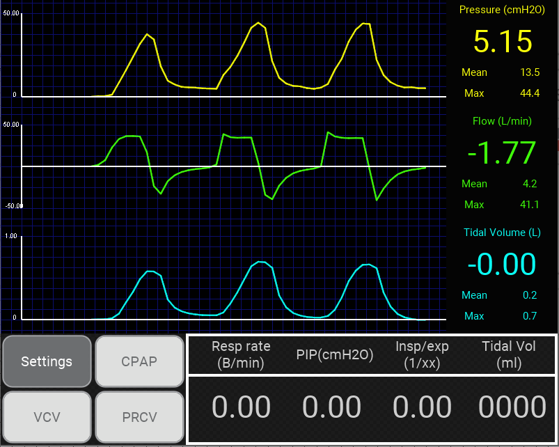
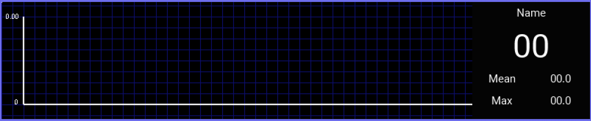
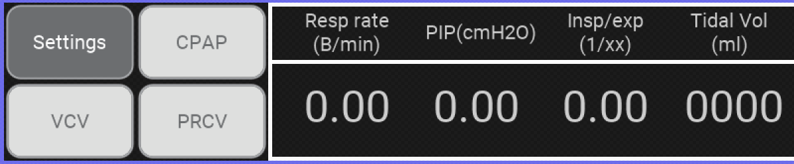

This folder contains the project `VentilatorUI.epw` which will generate the C files required for the GUI of the ventilator.

### Instructions

In order to genrated the .c and .h files required in the ventilator projects (demoxxx or other .uvproj projects) follows these steps.

1. download and install Embedded Wizard [Free Edition](https://www.embedded-wizard.de/pricing/) at https://www.embedded-wizard.de/download selecting the target platform `STM32F746 Discovery`.
2. open file `VentilatorUI.epw` w/ Embedded Wizard Studio by double clicking on it.
3. Select target STM32F746 and press BUILD. the folder `STM32F746` now contains the generated code.
4. Copy this folder into  `ventilator/tests/boards/stm32f7disco/ew/app/GeneratedCode` .

Now, the files will be visible into your project.

### Description

The Graphical User Interface of the ventilator FI5 looks like this:

From the top to the bottom it presents three `Dataplotter`, respectively for `Pressure(cmH20)`, `Flow(L/min)` and `Tidal Volume(L)`, and a `Menubar`.

#### Dataplotter

The `Dataplotter` class implements a method called `onDraw(float)` that given a float as input , it add it as point in the graph and compute the mean and max of the values received until then. On the right it is displayed the current value, and below the mean and max values.

#### Menubar

The `Menubar` displays the values of the relative knobs, and presents also a set of buttons in order to change the configurations of the ventilator.