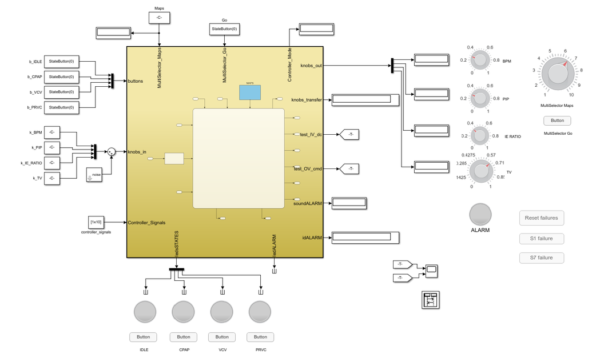
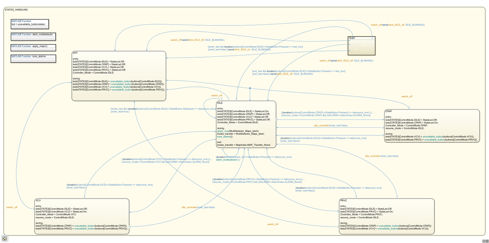
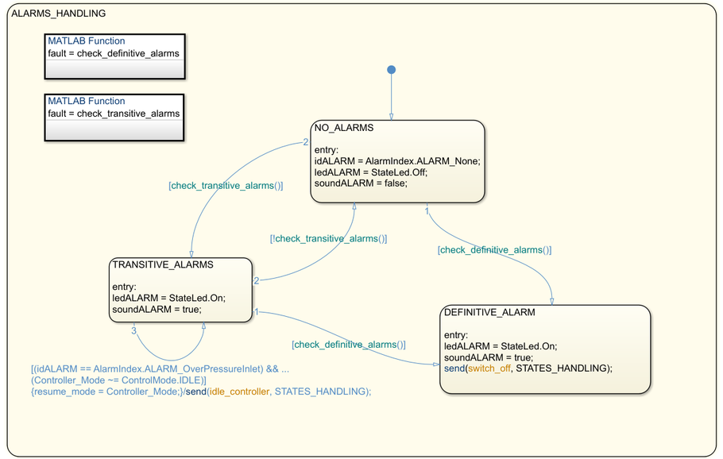

FSM Design
==========

The [Finite-State Machine](https://en.wikipedia.org/wiki/Finite-state_machine) (FSM) has been implemented in Stateflow for fast-prototyping the code. The FSM is responsible for handling the Human-Machine Interface (HMI) in terms of buttons, knobs, multiselector and the LED's as well as for handling the alarms.

More details can be found in [**`FI5 technical specifications`**](https://github.com/icub-tech-iit/ventilator-FI5/blob/master/design/FI5-specs.pdf).



## HMI Handling



## Alarms Handling



### Example of generated main
The following snippet shows how to interface with the generated code.

```c++
#include <stddef.h>
#include <stdio.h>
#include "FSM0.h"
#include "rtwtypes.h"

static FSM0ModelClass FSM0_Obj;             // Instance of model class
static controllerModelClass controller_Obj; // Instance of model class

void rt_OneStep(void);
void rt_OneStep(void)
{
  static boolean_T OverrunFlag = false;

  // Disable interrupts here

  // Check for overrun
  if (OverrunFlag) {
    rtmSetErrorStatus(FSM0_Obj.getRTM(), "Overrun");
    return;
  }

  OverrunFlag = true;

  // Save FPU context here (if necessary)
  // Re-enable timer or interrupt here
  // Set model inputs here

  FSM0ModelClass::ExtU_FSM0_T inputs;
  inputs.buttons[0] = Released;        // (enum StateButton {Released, Pressed})
  inputs.buttons[1] = Pressed;         // (enum StateButton {Released, Pressed})
  inputs.buttons[2] = Pressed;         // (enum StateButton {Released, Pressed})
  inputs.buttons[3] = Released;        // (enum StateButton {Released, Pressed})
  inputs.knobs_in[0] = 0.F;            // (float in [0,1])
  inputs.knobs_in[1] = 0.F;            // (float in [0,1])
  inputs.knobs_in[2] = 0.F;            // (float in [0,1])
  inputs.knobs_in[3] = 0.F;            // (float in [0,1])
  inputs.Controller_Signals[0] = 0.F;  // (float) to be filled in from the controller
  inputs.Controller_Signals[1] = 0.F;  // (float) to be filled in from the controller
  inputs.Controller_Signals[2] = 0.F;  // (float) to be filled in from the controller
  inputs.Controller_Signals[3] = 0.F;  // (float) to be filled in from the controller
  inputs.Controller_Signals[4] = 0.F;  // (float) to be filled in from the controller
  inputs.Controller_Signals[5] = 0.F;  // (float) to be filled in from the controller
  inputs.Controller_Signals[6] = 0.F;  // (float) to be filled in from the controller
  inputs.Controller_Signals[7] = 0.F;  // (float) to be filled in from the controller
  inputs.Controller_Signals[8] = 0.F;  // (float) to be filled in from the controller
  inputs.Controller_Signals[9] = 0.F;  // (float) to be filled in from the controller
  inputs.MultiSelector_Maps = 0;       // (uint32)
  inputs.MultiSelector_Go = false;     // (boolean)
  FSM0_Obj.setExternalInputs(&inputs);

  // Step the model
  FSM0_Obj.step();

  // Get model outputs here
  const controllerModelClass::ExtY_FSM0_T& outputs = FSM0_Obj.getExternalOutputs();
  outputs.knobs_out[0];     // (float) to be used for display
  outputs.knobs_out[1];     // (float) to be used for display
  outputs.knobs_out[2];     // (float) to be used for display
  outputs.knobs_out[3];     // (float) to be used for display
  outputs.knobs_transfer;   // (enum MapIndex) trigger to update controller’s params
  outputs.test_IV_dc;       // (float) to be used to command CP valve in TEST
  outputs.test_OV_cmd;      // (boolean) to be used to command CFB valve in TEST
  outputs.soundALARM;       // (boolean) to be used to activate the buzzer
  outputs.idALARM;          // (enum AlarmIndex) to be used for alarms messages LUT
  outputs.ledsSTATES[0];    // (enum StateLed {Off, On}) to control LED state
  outputs.ledsSTATES[1];    // (enum StateLed {Off, On}) to control LED state
  outputs.ledsSTATES[2];    // (enum StateLed {Off, On}) to control LED state
  outputs.ledsSTATES[3];    // (enum StateLed {Off, On}) to control LED state
  outputs.ledARLARM;        // (enum StateLed {Off, On}) to control LED state
  outputs.Controller_Mode;  // (enum ControlMode {IDLE, CPAP, VCV, PRVC})
                            // beware that this field needs to be incremeted by
                            // 1 prior to filling in Controller_control_mode

  // Interface FSM/Controller
  controllerModelClass::P_controller_T parameters = controller_Obj.getBlockParameters();

  // controller’s state handling
  parameters.Controller_control_mode = outputs.Controller_Mode + 1;

  // knobs and maps handling
  switch (outputs.knobs_transfer) {
    case MAP_Transfer_Standard:
      parameters.respiratory_rate_Value = outputs.knobs_out[0];
      parameters.PIP_Gain = outputs.knobs_out[1];
      parameters.IE_ratio_Value = outputs.knobs_out[2];
      parameters.TidalVolume_Gain = outputs.knobs_out[3] / 1000.F;
      break;

    case MAP_Transfer_VCV:
      parameters.VC_P_Value = outputs.knobs_out[0];
      parameters.VC_I_Value = outputs.knobs_out[1];
      parameters.VC_P_rec_Value = outputs.knobs_out[2];
      parameters.VC_I_rec_Value = outputs.knobs_out[3];
      break;

    case MAP_Transfer_PRVC_1:
      parameters.Controller_PC_P = outputs.knobs_out[0];
      parameters.Controller_PC_I = outputs.knobs_out[1];
      parameters.Controller_PC_P_rec = outputs.knobs_out[2];
      parameters.Controller_PC_I_rec = outputs.knobs_out[3];
      break;

    case MAP_Transfer_PRVC_2:
      parameters.Controller_FFW = outputs.knobs_out[0];
      parameters.Controller_FFW_rec = outputs.knobs_out[1];
      parameters.PIP_step_perc_Gain = outputs.knobs_out[2];
      parameters.PIP_rise_perc_Value = outputs.knobs_out[3];
      break;

    case MAP_Transfer_AutoTrigger:
      parameters.enable_trigger_Value = (outputs.knobs_out[0] > 0.5);
      parameters.pressure_thres_const = outputs.knobs_out[1];
      parameters.flowby_target_Value = outputs.knobs_out[2];
      break;
  }

  // Indicate task complete
  OverrunFlag = false;

  // Disable interrupts here
  // Restore FPU context here (if necessary)
  // Enable interrupts here
}

int_T main(int_T argc, const char *argv[])
{
  // Unused arguments
  (void)(argc);
  (void)(argv);

  // Initialize model
  FSM0_Obj.initialize();

  printf("Warning: The simulation will run forever. "
         "Generated ERT main won't simulate model step behavior. "
         "To change this behavior select the 'MAT-file logging' option.\n");
  fflush((NULL));
  while (rtmGetErrorStatus(FSM0_Obj.getRTM()) == (NULL)) {
    //  Perform other application tasks here
  }

  // Disable rt_OneStep() here

  // Terminate model
  FSM0_Obj.terminate();
  return 0;
}
```