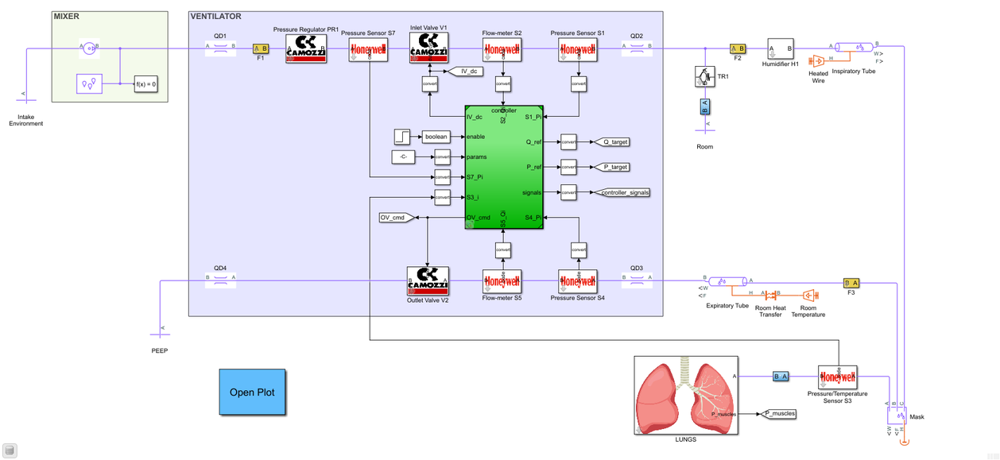
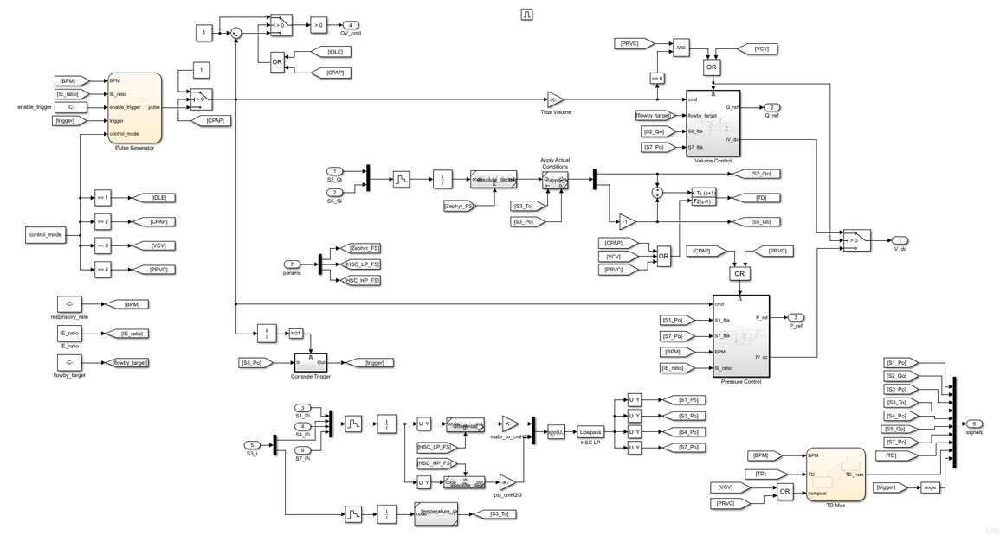
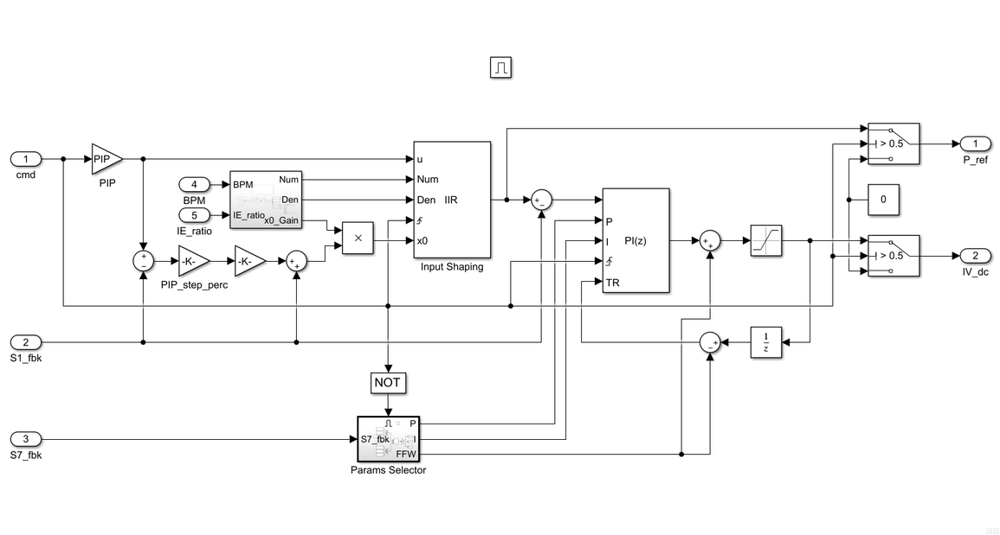

Control Design
==============

The controller has been designed and realized in Simulink and tested within a meaningful subset of the pneumatic circuit implemented in Simscape.

More details can be found in [**`FI5 technical specifications`**](../../design/FI5-specs.pdf).

The Embedded Coder is then used to generate the corresponding code of the controller that can be profitably deployed on the target device.

The controller, whose main architecture is shown below, comprises the following modules:
- Filtering stage
- Time generator and autotriggering
- Volume controller
- Pressure controller
- Tidal volume computation
- Tidal volume maximum value computation

## Volume Control Ventilation
The VCV mode is implemented through a PI controller complemented with a autoadaptive feed-forward term. Finally, the controller's gains can be scheduled based on the pressure delivered by PR1 and sensed by S7.

## Pressure Regulated Volume Control
The PRVC mode is implemented through a PI controller complemented with a static feed-forward term. The reference square-wave with high-level PIP is further shaped by a dedicated module that is responsible for providing a given onset step and a smoother minimum-jerk profile towards the final setpoint. Finally, the controller's gains can be scheduled based on the pressure delivered by PR1 and sensed by S7.

