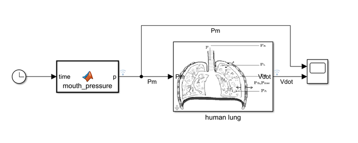
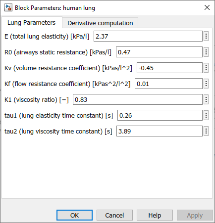
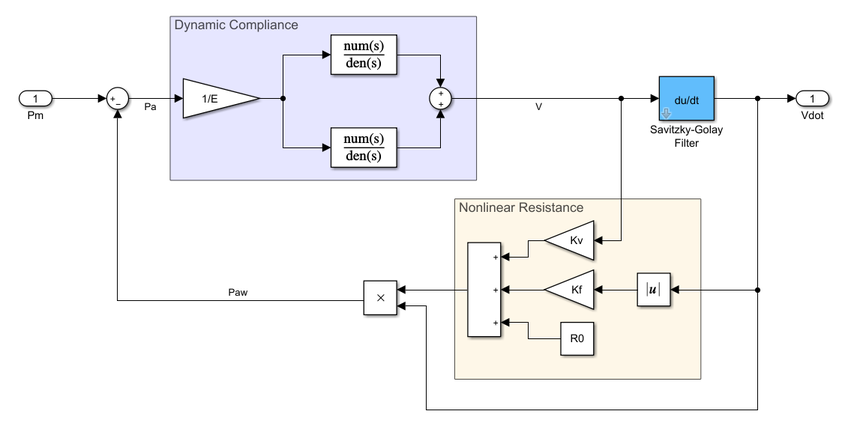
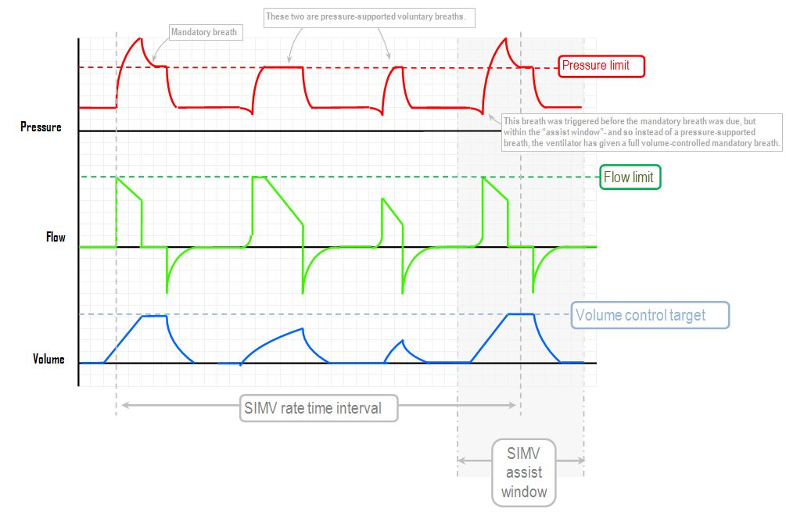
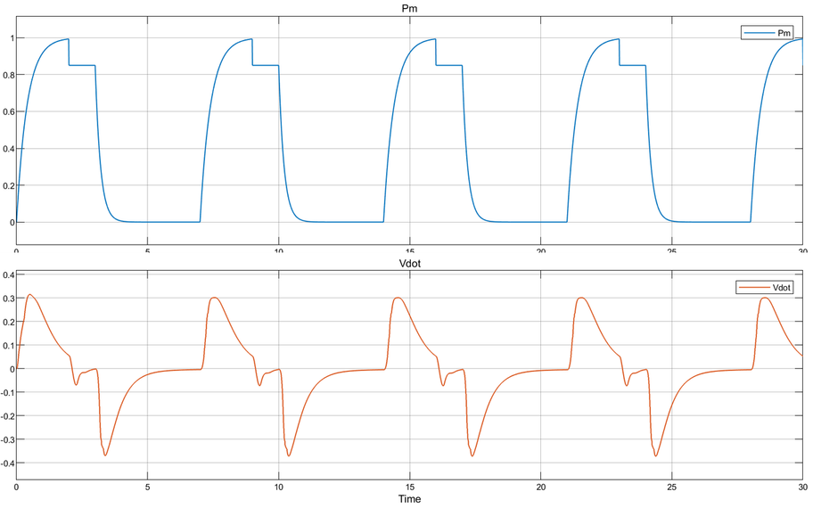

Model of Human Lung
===================

This Simulink model is based on the article [Mesic _et al._ (2003)](https://github.com/icub-tech-iit/ventilator/blob/doc/papers/mesic-2003.pdf).

### Versioning
| Model | Dependencies | Notes | 
|:---|:---|:---|
| human_lung_R2020a | R2020a: DSP System Toolbox; MATLAB; Simulink | Derivatives implemented w/ least-squares fitting | 
| human_lung_R2019b | R2019b: DSP System Toolbox; MATLAB; Simulink | Derivatives implemented w/ least-squares fitting |
| human_lung_R2017b | R2017b: MATLAB; Simulink | Derivatives implemented w/ transfer function |

👉 To get the list of dependencies, do: **Modeling** > **Compare** > **Manifest** > **Generate Manifest** (disable "Find files required for code generation").

### Overview
The parameters describing the lung can be tuned through the mask shown below (double-click on the main block).

Internally, the diagram copies what done in the article barring the implementation of the derivative, which in turn resorts to an **adaptive windows least-squares fitting estimation** ([Janabi-Sharifi _et al._ (2000)](https://doi.org/10.1109/87.880606)). Alternatively, the derivative can be implemented with a suitable transfer function.

This design approach enables a more robust computation of the time derivative of the lung volume that tend to be affected by simulation parameters, in particular the input waveform and the sample time imposed by the solver.

A qualitative validation has been performed providing good results.

A typical output of a ventilator is reported hereinafter.

The mouth pressure given to the patient has been coded in the input block to (roughly) resemble the typical profiles and the resulting simulation outputs are illustrated below.

