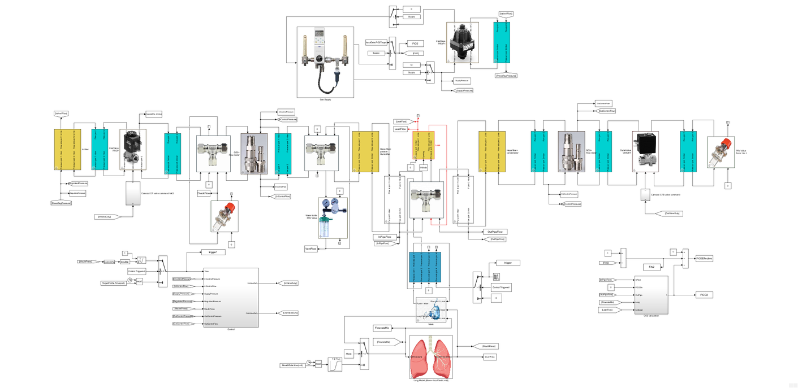

Simulation
==========

We have developed a complete Simulink model of the ventilator manifold along with the human lungs and equipment comprising the pipes, the humidifier, and the mask. The main objectives were:
1. to perform a suitable sizing of the pneumatic circuit;
1. to study the permeability of the inlet and outlet valves;
1. to analyze the impact on pressure dynamics resulting from the use of a respiratory mask and an helmet with a particular care to CO2 rebreathing;
1. to carry out preliminary FMEA analyses.

More details can be found in [**`FI5 technical specifications`**](../../design/FI5-specs.pdf).

