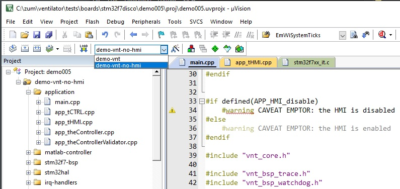

### BASIC INFO

This folder contains demos which run on the stm32f7disco board used for the ventilator.

The demo with the highest number is the most recent (!) and also the one which collects more and more features which will form the final application.

In order to run the demos you shall:

- open project `osal/proj/osal-v5.uvprojx` and compile it to produce library `osal/lib/osal.cm4.dbg.lib`,
- open project `stm32hal/proj/stm32hal.f7.uvprojx` and compile it to produce library `stm32hal/lib/stm32hal.f7disco.v1280.lib`,
- from projects from demo005 onward: if you decide to include the HMI (details below) pls be sure that folder `ew` contains code from embedded wizard, so far in evaluation license. in case it is missing, pls mailto: marco.accame@iit.it
- open the project you want. at the date of writing (2020 Apr 23) it is the project `demo005/proj/demo005.uvprojx`.

### HOW TO enable the HMI

just chose the target labeled `-no-hmi` as in the following picture.

