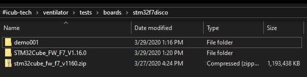
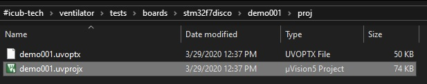
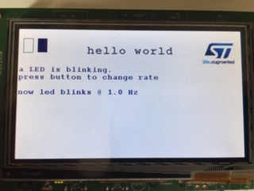

## Basic demo on board **32F746GDISCOVERY**.

This demo tests basic functionalities of the board. It

- blinks a LED at various timing, 
- prints a string on the TRACE port for debug purposes
- uses a graphic LCD display with bitmaps, geometric shapes, user text at various fonts.

### Requirements

The demo requires:

- a ARM Keil MDK compiler (https://www.keil.com/demo/eval/arm.htm)
- CUBE-MX from STM
- the board (https://www.st.com/en/evaluation-tools/32f746gdiscovery.html)
- a mini USB cable.

### How to compile and run

Here is how to run the demo.

1. retrieve from STM the archive `stm32cube_fw_f7_v1160.zip` which contains code for the STM32F7 family of MPUs. If you use CUB-MX you must install the following and then retrieve this file from a path like that `C:\Users\maccame\STM32Cube\Repository`.

   

2. unzip the file in a folder called `STM32Cube_FW_F7_V1.16.0` which sits along with `demo001` as in the following picture

   

3. open the project 

   

4. compile, attach a USB cable to the board, program the FLASH and run the program

   

