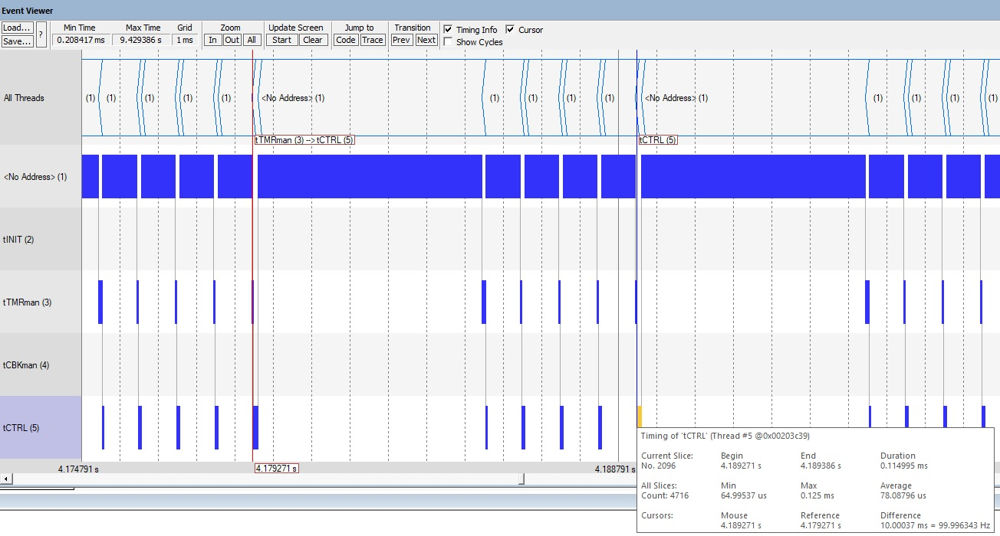
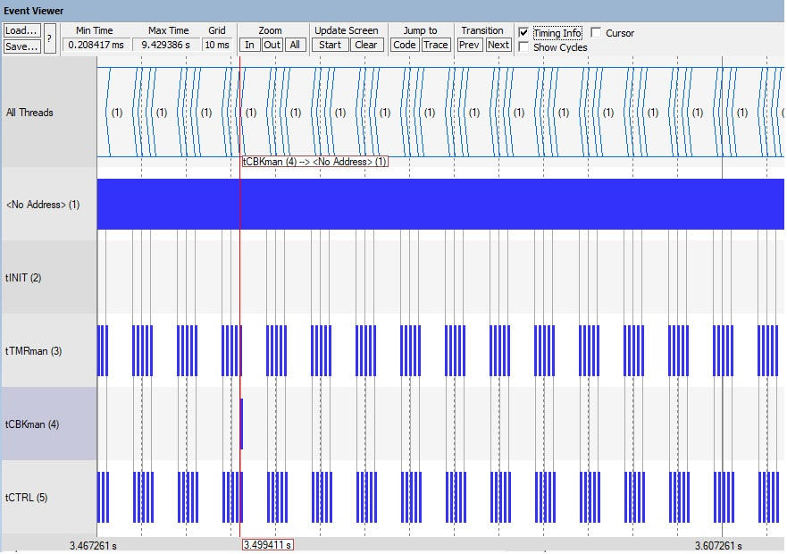

## demo003

This demo simulates a skeleton of the control loop @ 100 hz with simulated use of some pressure sensors, call of the matlab-generated controller and valve actuation.


| Author       | Date          |
| ------------ | ------------- |
| Marco Accame | 10 April 2020 |


### Results

The results show a very precise timing and a lot of idle CPU time inside the 10 ms window.

```
->
@ S2:m680:u045 tCTRL commands to HW to start acquisition of 3 sensors
@ S2:m681:u018 tCTRL has retrieved sensor 1: 3.669997@S2:m680:u772
@ S2:m682:u018 tCTRL has retrieved sensor 2: 4.670013@S2:m680:u780
@ S2:m683:u018 tCTRL has retrieved sensor 3: 5.670037@S2:m680:u788
@ S2:m684:u017 tCTRL executes the control
@ S2:m684:u480 tCTRL has applied values 15.010048 16.010048
<-

->
@ S2:m690:u045 tCTRL commands to HW to start acquisition of 3 sensors
@ S2:m691:u018 tCTRL has retrieved sensor 1: 3.679997@S2:m690:u772
@ S2:m692:u018 tCTRL has retrieved sensor 2: 4.680014@S2:m690:u780
@ S2:m693:u018 tCTRL has retrieved sensor 3: 5.680037@S2:m690:u788
@ S2:m694:u017 tCTRL executes the control
@ S2:m694:u480 tCTRL has applied values 15.040049 16.040049
<-

```

**Figure 1**. The ITM trace log of the control loop




**Figure 2**. The scheduling of the system at 1 ms granularity. The control loop **tCTRL** executes at 100 Hz four actions: command sensor acquisition, retrieval of three sensors and finally execute the control to produce the output for the two valves. The system is idle most of the time (top line tagged `<No Address> (1)`) .




**Figure 3**. The scheduling of the system at 10 ms granularity.


### The system infrastructure

 The system is formed of:

1. a **Scheduler** which operates in fully-preemptive mode assigning execution to the highest priority thread which is ready to execute. The context switching time on a CM4 @ ~200 MHz (our ems board) is just a few usec.  The scheduler starts the **threadINIT** which is responsible to activate at maximum priority and in exclusive mode all the services and user threads and then exits allowing the system to execute other threads. It also starts the **threadIDLE** which is executed when no other thread is ready. The scheduler gets its beat from the **systTick** HW timer and offers time measure at **usec resolution**  even if it is typically ticked at **tick = 1ms**. 
2. a **TimerManager** which handles timers which execute actions in a periodic or oneshot manner. The actions can be the sending of event flags to threads or request to a worker thread of execution of callbacks (short functions).
3. a **CallbackManager** which handles execution of callbacks (short functions), such as LED pulsing, in the future polling of the not critical push-buttons, etc.
4. any **user-defined threads** launched by the the threadINIT. Typically, the threads follow an event-based execution paradigm. An event-based thread stays idle until some entity (a timer or an IRQHandler) sends to it an event. at this stage, the thread gets ready, it is executed and **should terminate ASAP** the relevant operation. 
5. any other service launched by the threadINIT, such as **theLEDmanager** which allows independent management of LEDs for blinking or for reproducing a waveform.
6. the system also allows to show on a scope-like GUI, the **eventviewer**, the timing and scheduling of the various threads. 

 

### The interface to the HW board

It is achieved through several components:

1. The STM32 HAL as provided by STMicroelectronics for this MPU and this board. It comes in the form of a library linked to the project with a single header file: `stm32hal.f7disco.v1280.lib` and `stm32hal.h`.
2. The BSP for this board which STMicroelectronics offers. I have extracted so far support for: LEDs, push-buttons, LCD display, QSPI FLASH (**TODO**: add support to touchscreen again). This package comes by .c and .h files.
3. user-defined code developed by myself or by other developers to get tailored access to HW or to attached chips through the use of STM32 HAL or at even lower level. So far, this code is limited to: **ITM trace**, assembly code for generating **precise delays**. But I expect that this part of code will significantly grow to provide support to low level **sensors and actuators chips**  
4. The user-code wraps the above heterogeneous components in a uniform environment under the namespace **vnt::bsp** which offers:
   - definition of **measurement units** for sensors and actuators,
   - definition of nicknames of the sensors and actuators and HMI objects (LEDs, push-buttons, etc.) which are partly aligned to **BOM rev 9**.
   - definition of **uniform API** for reading from sensors (blocking mode w/ timeout + non-blocking mode w/ alert on completion) and for applying values to actuators (non-blocking mode) and also for managing a **watchdog timer**.
   - so far, the skeleton implementation of pressure sensors and valves with all relevant manipulating functions in namespaces **vnt::bsp::sns::pressure**  and **vnt::bsp::act::valve**. The functions have placeholders and comments for insertion of C or C++ code which manages the chips. For now, by defining macro `TEST_VNT_BSP_SNS_PRESSURE` the **pressure::read()** function in non-blocking mode simulates the presence of the chip with fake values and deferring the alert (or callback) by a fixed amount of time.


### Description of the demo003

This demo uses:

-  the system modules: **Scheduler**, **TimerManager**, **CallbackManager**;
-  a user-defines  high priority thread called **threadCTRL ** which runs the control loop;
-  the **evt::bsp** namespace to have access to HW both real and simulated (the sensors, actuators and the watchdog timer are simulated);
-  a fake controller which for now contains unrelated matlab-generated code;
-  and my pet object: **theLEDmanager** to blink a LED at 1 Hz. 

We can later add a manager properly dedicated to the HMI which works at lower priority.


#### The threadCTRL

The main thread, called **threadCTRL**, is executed at high priority on an event-based mode: it means that executes only when triggered by event flags, it operates quickly and and if not trigged it stays idle.

The thread is regularly ticked by a pair of periodic event flags @ 10 m which have an offset of a few milliseconds.

- the first event `evtSNSRacquire` triggers sensor acquisition in non-blocking mode (it is not possible to stop and wait for slow peripherals). The acquisition is typically delegate to the HW which alerts the end of its execution through IRQHandlers. For now we have just **emulated the IRWHandlers** with software timers. 
- the second event `evtCTRLtick` triggers the execution of the control. 

The IRQHandlers send other three events to the threadCTRL (`evtSNSRready01`, `evtSNSRready02`, `evtSNSRready03`) upon availability of the sensors' data. At reception of these events the thread just copies the sensors' values which will be ready for the controller.

The time gap between the two events is configured = 4 millisec to allow:

1. the sensor chips to acquire their values, 
2. the IRQHandlers (simulated for now by an action triggered by a timer) to signal to the threadCTRL  the availability of the sensors' data 
3. the threadCTRL to be activated so that  it can copy sensors' data which will be passed to the controller.


Hence, the correct execution of  `threadCTRL.onevent()` is as follows:


**Figure 4**. The execution of `threadCTRL.onevent()`. Each quadrant is 1 ms.


Finally, at each call of  `threadCTRL.onevent()` it is called a refresh of the WDT:

```C++
    
void tCTRL_onevent(vnt::os::Thread *t, vnt::os::EventMask eventmask, void *param)
{
    vnt::bsp::watchdog::refresh();  
    
    if(0 == eventmask)
    {   // timeout ...         
        return;
    }

    if(true == vnt::core::binary::mask::check(eventmask, evtSNSRacquire))
    {
        ...
```


**MEMO**: write in a note that we could add a check of the duration of each execution of the `threadCTRL.onevent()`. We could also use object `embot::tools::PeriodValidator` to verify the regularity of execution of critical code such as the controller.


### Used languages

The demo integrates C and C++ and assembly where required: it uses C++-14 for the framework, C for the HAL drivers, assembly for startup and precise delay functions, matlab-generated C++ for the controller.


### NOTES

1. This approach for a control loop follows two timers: one that triggers acquisition and another at fixed interval which triggers the execution of the control. This solution was designed to keep equal distance between two actuations of control. But after demo and discussion w/ the SW-FW team @pattacini suggests that a small drift in the actuation is not so critical, hence to simplify the design we shall evaluate  a solution w/ a single timer which starts acquisition of the sensors. It will be the last sensor to arrive to the control loop which will trigger execution of the control. 

2. After the preparation of this document I could test the latest version of the matlab generated control code in to versions: double precision and single precision. I did focused tests to measure the duration of these two versions of code. See issue https://github.com/icub-tech-iit/ventilator/issues/34.

   