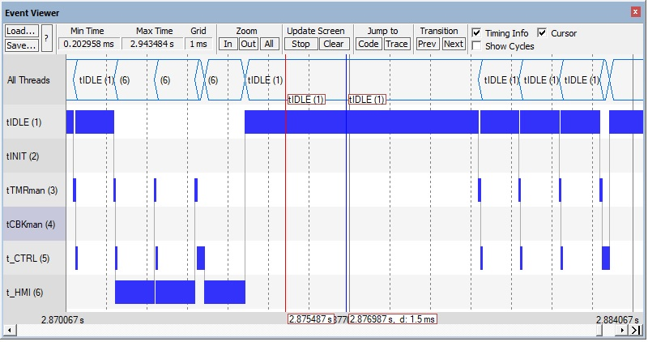

## demo004

This demo develops from demo003 and refactors the application code in more files and data structures so that any test is much cleaner. Moreover, it adds a second thread at lower priority to manage the HMI.

It is possible to run the demo004 with the following macro `TEST_tCTRL_control_use_stored_IO` being defined so that the controller can be validated against the results achieved by the MATLAB  simulation. 

In such a case, the controller is fed with the very same inputs as the MATLAB simulation and its results are compared with a target which is the output of MATLAB  simulation.


| Author       | Date          |
| ------------ | ------------- |
| Marco Accame | 22 April 2020 |


### Results

The results of running w/ macro `TEST_tCTRL_control_use_stored_IO` being defined show that the C++ code generated by MATLAB when added to our demo004 behaves exactly as ... MATLAB. Also they show that the time used by the control is very short.

See issue https://github.com/icub-tech-iit/ventilator/issues/34.

The results of the issues were run w/ a modification of demo003 project. if we use demo004 we use similar results.

The duration of MATLAB tick is about 11 usec.

```
...

numbers are:
step, duration of tick, target == output, total error, input, target0, target1, target2, target3, output0, output1, output2, output3

0, 1, m0:u011, 0.000000, 2048.000000, 40.708961, 4.964314, 0.000000, 0.000000, 40.708961, 4.964314, 0.000000, 0.000000
1, 1, m0:u012, 0.000000, 2064.384033, 41.967339, 4.966773, 5.098599, 0.203255, 41.967339, 4.966773, 5.098599, 0.203255
2, 1, m0:u011, 0.000000, 2080.768066, 42.886780, 4.973876, 5.302544, 0.653502, 42.886780, 4.973876, 5.302544, 0.653502
3, 1, m0:u011, 0.000000, 2097.152100, 43.480446, 4.988204, 5.506488, 1.278653, 43.480446, 4.988204, 5.506488, 1.278653
4, 1, m0:u011, 0.000000, 2113.536133, 43.606361, 5.011866, 5.710432, 2.160530, 43.606361, 5.011866, 5.710432, 2.160530
5, 1, m0:u011, 0.000000, 2129.919922, 43.272293, 5.046553, 5.914377, 3.229539, 43.272293, 5.046553, 5.914377, 3.229539
6, 1, m0:u011, 0.000000, 2146.303955, 42.597908, 5.093592, 6.118319, 4.337004, 42.597908, 5.093592, 6.118319, 4.337004
7, 1, m0:u011, 0.000000, 2162.687988, 41.758514, 5.153981, 6.322263, 5.324672, 41.758514, 5.153981, 6.322263, 5.324672
8, 1, m0:u011, 0.000000, 2179.072021, 40.928253, 5.228437, 6.526207, 6.076567, 40.928253, 5.228437, 6.526207, 6.076567
9, 1, m0:u011, 0.000000, 2195.456055, 40.236820, 5.317426, 6.730151, 6.545549, 40.236820, 5.317426, 6.730151, 6.545549
10, 1, m0:u011, 0.000000, 2211.840088, 39.747360, 5.421200, 6.934096, 6.754559, 39.747360, 5.421200, 6.934096, 6.754559
11, 1, m0:u011, 0.000000, 2228.224121, 39.456169, 5.539822, 7.138040, 6.778560, 39.456169, 5.539822, 7.138040, 6.778560
12, 1, m0:u011, 0.000000, 2244.607910, 39.309288, 5.673196, 7.341985, 6.716506, 39.309288, 5.673196, 7.341985, 6.716506
13, 1, m0:u011, 0.000000, 2260.991943, 39.228058, 5.821088, 7.545926, 6.662865, 39.228058, 5.821088, 7.545926, 6.662865
14, 1, m0:u011, 0.000000, 2277.375977, 39.135105, 5.983148, 7.749870, 6.686161, 39.135105, 5.983148, 7.749870, 6.686161
15, 1, m0:u011, 0.000000, 2293.760010, 38.974194, 6.158929, 7.953815, 6.818471, 38.974194, 6.158929, 7.953815, 6.818471
16, 1, m0:u011, 0.000000, 2310.144043, 38.720325, 6.347905, 8.157759, 7.056146, 38.720325, 6.347905, 8.157759, 7.056146
17, 1, m0:u011, 0.000000, 2326.528076, 38.379742, 6.549481, 8.361705, 7.369124, 38.379742, 6.549481, 8.361705, 7.369124
18, 1, m0:u011, 0.000000, 2342.912109, 37.982052, 6.763014, 8.565648, 7.714656, 37.982052, 6.763014, 8.565648, 7.714656
19, 1, m0:u011, 0.000000, 2359.295898, 37.568268, 6.987819, 8.769593, 8.051018, 37.568268, 6.987819, 8.769593, 8.051018
20, 1, m0:u011, 0.000000, 2375.680176, 37.178616, 7.223179, 8.973535, 8.347848, 37.178616, 7.223179, 8.973535, 8.347848
21, 1, m0:u011, 0.000000, 2392.063965, 36.843235, 7.468359, 9.177482, 8.591274, 36.843235, 7.468359, 9.177482, 8.591274
22, 1, m0:u011, 0.000000, 2408.447998, 36.577408, 7.722613, 9.381423, 8.783747, 36.577408, 7.722613, 9.381423, 8.783747
23, 1, m0:u011, 0.000000, 2424.832031, 36.381565, 7.985187, 9.585367, 8.939802, 36.381565, 7.985187, 9.585367, 8.939802
24, 1, m0:u011, 0.000000, 2441.216064, 36.244907, 8.255329, 9.789312, 9.079747, 36.244907, 8.255329, 9.789312, 9.079747

...

```

**Figure 1**. The ITM trace log of thread tCTRL showing the first 25 ticks. Duration of the tick is 11 usec. The computed outputs are equal to the expected targets.


Moreover, here is shown how the tHMI is scheduled. For tests I have scheduled this thread every 33 ms, so that it may eventually interfere  with the tCTRL. We can see that the higher priortity tCTRl is pre-empted.

Note: the last tick of the tCTRL in here lasts a lot more, about 120 usec, because of the formatting of the string shown before. **Yes, sic: this string-manipulation activity useful for debugging lasts from 100 to 180 usec depending on compiler optimization**.

  



**Figure 2**. The scheduling of the system at 1 ms granularity. The control loop **tCTRL** executes at 100 Hz the start of sensor acquisition. When all sensors are acquired it executes the control. In this simulation we also process intermediate acquisitions for debug purposes. The thread tHMI happens to execute at the same time as the tCTLR and we can see that is is pre-empted.


