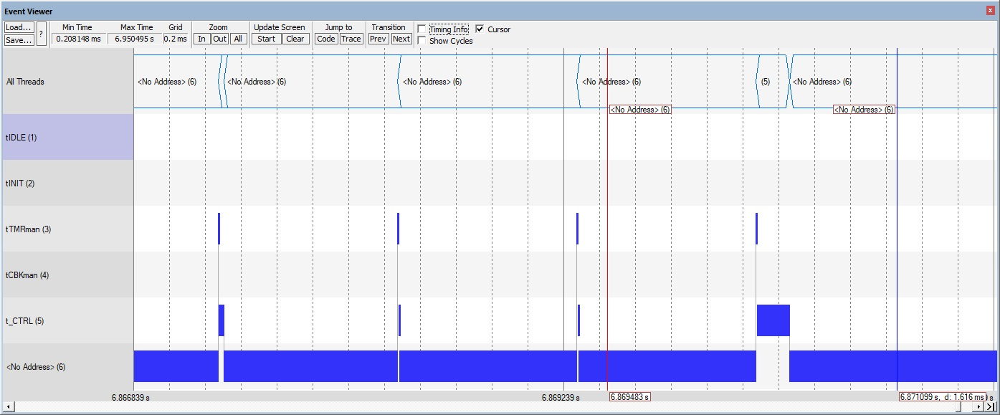

## demo005

This demo develops from demo004 and adds a GUI ticked every 66 ms by thread tHMI.

The GUI is run by https://www.embedded-wizard.de/, for which we have an evaluation license.

We run the `CLIMATE CABINET` demo, also available (and runnable) at https://www.embedded-wizard.de/demo.

The GUI does not interfere w/ the tCTRL thread as shown later.

| Author       | Date          |
| ------------ | ------------- |
| Marco Accame | 22 April 2020 |

### Results

The GUI is shown on LCD exactly as in the site.

Moreover, here is shown how the **tHMI** is scheduled. For tests I have scheduled this thread every 63 ms, so that it may eventually interfere  with the **tCTRL**. We can see that the higher priority **tCTRL** is pre-empted.

  

**Figure 1**. The scheduling of the system at 1 ms granularity. The control loop **tCTRL** executes every 10 ms the start of sensor acquisition. The thread **tHMI** executes every 66 ms in order to force interference w/  tCTLR. In such cases it is pre-empted. The tick lasts about 10 ms.

  

**Figure 2**. As shown in the zoom, the thread **tHMI** is pre-empted by **tCTRL**.

### Notes

This import of the embedded-wizard GUI was done quite quickly:

- pick up code from their demo, 
- did a first analysis of it,
- put it inside our project in the correct places, 
- changed low-level constructs incompatible w/ our project (give access to a 1ms clock, stm32 include file names etc).

hence, there are a number of things to be better analyzed. 

here are some notes:

- The GUI also initializes and uses the USART.

- It also triggers quite often the `LTDC_IRQHandler()` 
- the initialization works only (so far) is it is done in thread tINIT at maximum priority in exclusive mode. it does not work properly if it is executed inside the .startup() of thread tHMI which can be pre-empted by other threads. 
- the initialization calls again HAL_init() and the likes, thing that we do in stm32hal_init(). we should see how to avoid calling twice things.

