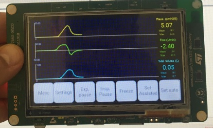
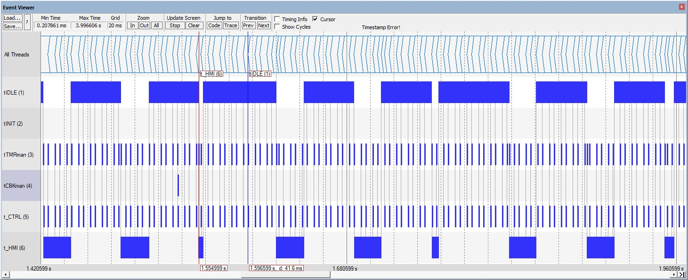

## demo006

This demo develops from demo005and adds:

-  a version of the GUI which simulates the ventilator waveforms as created by `VentilatorUI/VentilatorUI.ewp`
- interface vs the API in `drivers/board_driver.h`

| Author       | Date          |
| ------------ | ------------- |
| Marco Accame | 22 April 2020 |

### Results

The GUI is shown on LCD exactly as in the PC simulation.

**Figure 1**. The GUI.

**Figure 2. The scheduling of the system at 20 ms granularity. The thread **tHMI** ticks every 66 ms and sometimes lasts longer. We should investigate what the tick does.

 Also, there is now a different execution of teh `tCTRL` thread: 

- there is one timer @ 10 ms and then 
- there is a single event from the driver which tells that all data is ready.

the tick of `tCTRL` which lasts longer simulates the control with the newly acquired values plus the actuation.

**Figure 3**. the **tCTRL** tasks for new data every 10 ms. data is ready after a fake time of 6 ms.

### NOTE

To compile w/ the GUI you need file `ew.demo006.zip`. pls ask it to marco.accame@iit.it

Else select target labeled `demo-no-hmi` as described in `stm32f7disco/README.md`.

